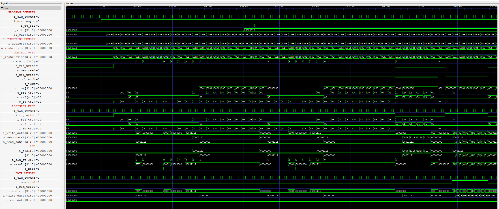

# RISC-V
Implementing a RISC-V Processor

## Single Cycle 
This project implements a single-cycle processor for the RV32I instruction set architecture. The RV32I base integer instruction set covers a 32-bit address space and includes essential operations such as arithmetic, control flow, and memory access. This implementation is designed to provide a clear and efficient representation of the RV32I instructions in a single-cycle architecture.

### Features
- Full RV32I base instruction set support
- Single-cycle execution for all instructions
- Implemented a single cycle RISC-V CPU. RV32I 

